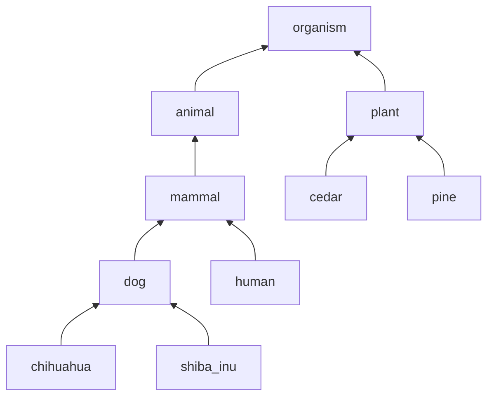
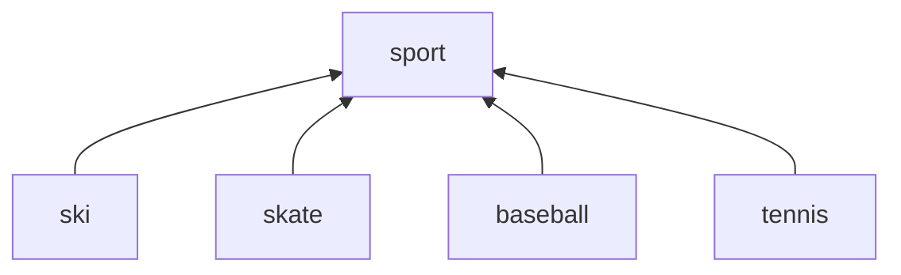
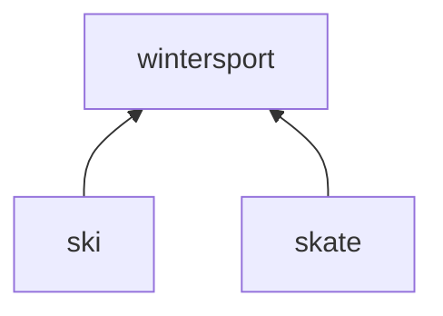
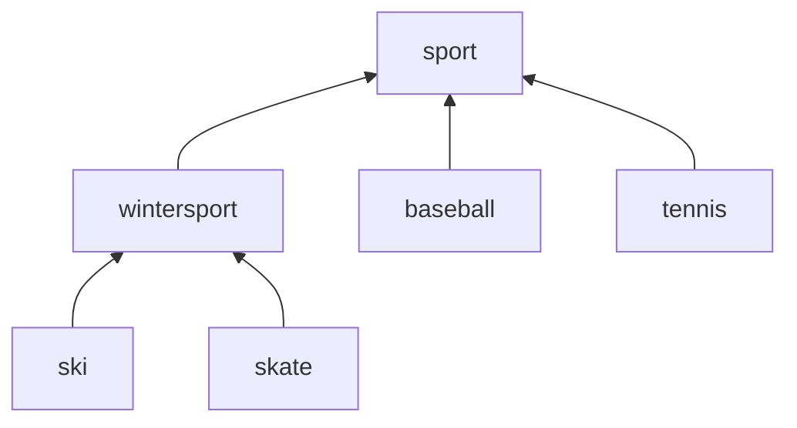

# HierarchicalCategories (階層化されたカテゴリの実装例)
階層化されたカテゴリを使用したい場面での手軽な実装例です。
- 「RDBMSの表の列やCSVの項目にcategoryの情報を付けて、カテゴリでフィルタできるようにしたい」などの使用場面をイメージしています。
- ライブラリというか、たんなる関数です。

## 例1: 
生き物の分類表です。
以下のような分類体系があるとします。



これは以下のように定義します。
```
const sampleCategories1 = [
    {
        "name": "organism"
    },
    {
        "name": "animal",
        "parents": ["organism"]
    },
    {
        "name": "mammal",
        "parents": ["animal"]
    },
    {
        "name": "dog",
        "parents": ["mammal"]
    },
    {
        "name": "chihuahua",
        "parents": ["dog"]
    },
    {
        "name": "shiba_inu",
        "parents": ["dog"]
    },
    {
        "name": "human",
        "parents": ["mammal"]
    },
    {
        "name": "plant",
        "parents": ["organism"]
    },
    {
        "name": "cedar",
        "parents": ["plant"]
    },
    {
        "name": "pine",
        "parents": ["plant"]
    }
];
```

これに対して ```expandCategories(sampleCategories1, "mammal")``` で ```{ 'mammal', 'dog', 'chihuahua', 'shiba_inu', 'human' }``` が得られます。

得られた集合を categoryNameSet などの変数名に割り当て ``` categoryNameSet.has(判定対象の文字列) ``` のような判定で使用することを想定しています。

## 例2: 

中間分類を後から追加する場合です。

以下のような分類があるとします。



これは以下のように定義します。
```
const sampleCategories2 = [
    {
        "name": "sport"
    },
    {
        "name": "ski",
        "parents": ["sport"]
    },
    {
        "name": "skate",
        "parents": ["sport"]
    },
    {
        "name": "baseball",
        "parents": ["sport"]
    },
    {
        "name": "tennis",
        "parents": ["sport"]
    }
];
```

以下の中間分類を後から追加します。



これは以下のように定義します。
```
const additionalCategories = [
    {
        "name": "wintersport",
        "parent": "sport",
        "children": ["ski", "skate"]
    }
];
```

定義をJavaScriptのarrayとして連結したものを作成します。
```
const categories = sampleCategories2.concat(additionalCategories);
```

これは以下のように定義したものと同一の問い合わせ結果を返却します。


つまり ```wintersport```に対して、```{ 'wintersport', 'ski', 'skate' }```が得られます。
<br> ```sport```に対しては、```{ 'sport', 'ski', 'skate', 'baseball', 'tennis' }```が得られます。

## 説明
指定されたノードを起点としてグラフを幅優先探索で辿り、到達可能なノードの集合を返しています。
<br> (幅優先探索については Wikipedia( https://ja.wikipedia.org/wiki/%E5%B9%85%E5%84%AA%E5%85%88%E6%8E%A2%E7%B4%A2 )などを参照してください)

上位 → 下位の順に定義されていれば、幅優先探索の最外側のループは1回で終わります。
<br> (処理時間の観点では、上位 → 下位の順に定義する方が望ましいです)

## サンプルの実行方法
サンプルプログラムを node.js の環境で実行する場合は以下のように行います。外部ライブラリは何も使用しません。

例1に対応するサンプルプログラムは、以下のように実行できます。
```
node sample1.js
```

例2に対応するサンプルプログラムは、以下のように実行できます。
```
node sample2.js
```
