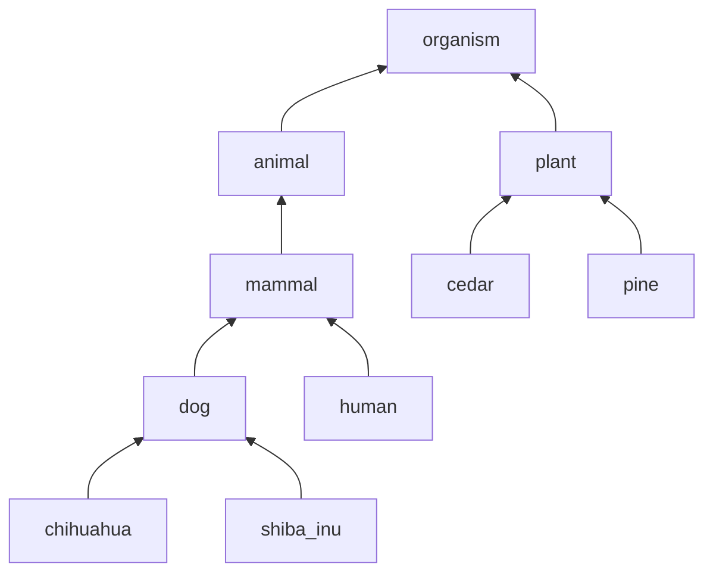
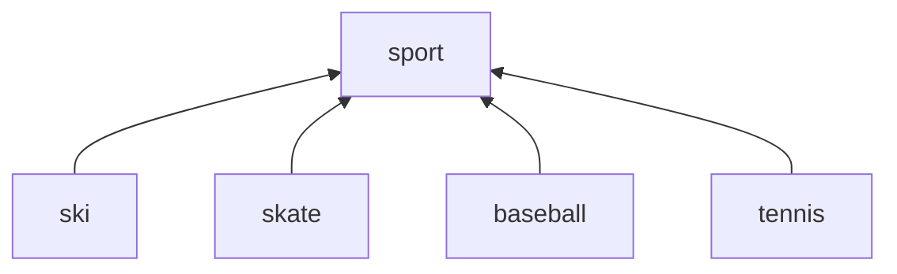
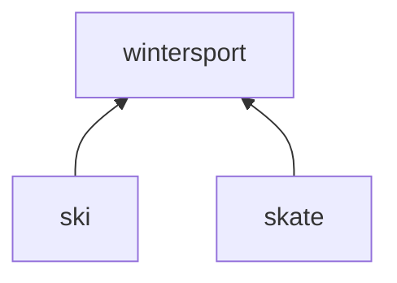
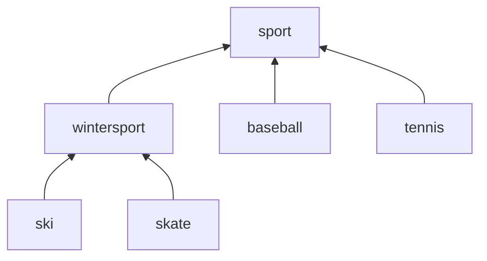

# 階層化されたカテゴリの実装例
初歩的な範囲のナレッジ処理を JSON と JavaScript で実装したものです。

## 概要説明
ここに置いてある資材は、階層化されたカテゴリを取り扱うための、ごく小さい規模での実装例です。
ごく小規模な意味ネットワーク(※)を身近な道具である JSON で記述し、 JavaScript で処理します。
具体的には、グラフのデータの JSON での記述方法と、良くあるグラフ探索アルゴリズムの JavaScript での実装の組み合わせで、ナレッジ処理を行うものです。
- ライブラリというよりは、ほぼ単なる関数です。
- ツリーではなく、有向グラフ(ツリー構造で、枝が合流するようになったものをイメージしてください)を取り扱います。
- 「RDBMSの表の列やCSVの項目にcategoryの情報を付けて、カテゴリでフィルタできるようにしたい」などの使用場面をイメージしています。

※ 意味ネットワーク
- 古い時代である1956年に [意味ネットワーク](https://ja.wikipedia.org/wiki/%E6%84%8F%E5%91%B3%E3%83%8D%E3%83%83%E3%83%88%E3%83%AF%E3%83%BC%E3%82%AF) という考え方が発明されています。
<br> (歴史上の初期に存在してその後消え去ったものではなく、
2012年5月16日にGoogleが [Google ナレッジグラフ](https://ja.wikipedia.org/wiki/Google_%E3%83%8A%E3%83%AC%E3%83%83%E3%82%B8%E3%82%B0%E3%83%A9%E3%83%95) を発表しています)
- この資材は、意味ネットワークの考え方をベースに、たんにグラフの探索で済むようなタスクに対して JSON と JavaScript での実装例を示すものです。

## カテゴリ情報のユースケース
### 1. エンティティの階層的なカテゴリ化

ごく素朴な例で説明します。

業種の分類がついた店舗の一覧があったとします。
業種の分類は以下に記述するものだとします。

- 店舗
  - 飲食店
    - ラーメン屋
    - そば屋
    - 定食屋
  - 文房具店

店舗の一覧は以下です。
| 店舗 | 分類 | 情報(所在地・電話番号など) |
| ---- | ---- | :----: |
| ▲ラーメン | ラーメン屋 | (略) |
| 凸凹そば | そば屋 | (略) |
| ○亭 | 定食屋 | (略) |
| □□文房具 | 文房具屋 | (略) |


以下のような場面があったとします。
- 場面1. 「ラーメン店を探したい」
- 場面2. 「お腹が減っているので飲食店を探したい」
- 場面3. 「地域の商品券が使える店舗を探したい」

場面ごとに、見せたい範囲が違います。

| No. | 場面 | 分類 | 該当する範囲 |
| ---: | ---- | ---- | ---- |
| 1 | 「ラーメン店を探したい」 | ラーメン屋 | {ラーメン屋} |
| 2 | 「お腹が減っているので飲食店を探したい」 | 飲食店 | {飲食店, ラーメン屋, そば屋, 定食屋} |
| 3 | 「地域の商品券が使える店舗を探したい」 | 店舗 | {店舗, 飲食店, ラーメン屋, そば屋, 定食屋, 文房具店} |

絞り込む範囲の列挙を生成します。

カタログ類の閲覧の効率性を高めたり、エントリの発見、エントリへのリーチを容易にします。

古い別のやり方では、カテゴリにコードを振り、コードの範囲で絞り込む等があります。
木構造に限定されます。

別のやり方として、「ラーメン屋」に対して、「飲食店」「ラーメン屋」の2つのタグをつける、という方法がありますが、カテゴリによる絞り込みと同じことを、タグのメンテナンスの際に手動などで行っていることになります。


### 2. リレーションのカテゴリ化

[推移的](https://ja.wikipedia.org/wiki/%E6%8E%A8%E7%A7%BB%E9%96%A2%E4%BF%82)な性質 ※1 を持つリレーションを再帰的に辿るときに、個別のリレーションの値でなくカテゴリを見ることで処理が素直に記述できる場合があります。

関係と関係の関係が、カテゴリとして以下のように定義されているとします。

- 先祖である (注: 推移的な関係)
    - 親である ( implies 先祖である。 注: 非推移的な関係 )
        - 父親である ( implies 親である。注: 非推移的な関係 )
        - 母親である ( implies 親である。注: 非推移的な関係 )

このとき、エンティティに対して以下のリレーションがあるとします。
有名な漫画の登場人物で例示してます。

| x             | y       | 関係 (意味)                 |
| :-----------: | :------: | :-----------------------: |
| のびろべえ ※2 | のび助   | 先祖である (xはyの先祖である) |
| 玉子          | のび太   | 母親である (xはyの母親である) |
| のび助        | のび太い | 父親である (xはyの父親である) |
| のび太        | ノビスケ | 父親である (xはyの父親である) |
| ノビスケ      | セワシ   | 先祖である (xはyの先祖である) |

「AがBの先祖であるか」ということは、Bから探索を開始してAに辿り着けるか、という処理で判定できます。

※1 関係が持つ重要な性質として、推移性、反射性、対称性があります。
- 推移的な関係は A→B, B→C のとき A→C が成立しています。
- [反射的](https://ja.wikipedia.org/wiki/%E5%8F%8D%E5%B0%84%E9%96%A2%E4%BF%82)な関係は全ての A に対して A → A が成立しています。
<br> (無反射関係として「A は B と等しくない」「A は B と互いに素である」「A は B より大きい」が例示されます)
- [対称的](https://ja.wikipedia.org/wiki/%E5%AF%BE%E7%A7%B0%E9%96%A2%E4%BF%82)な関係は A→B のとき B→A が成立しています。

| 推移性 | 対称性 | 反射性 | 例 |
| :---: | :---: | :---: | :-- |
|  ○    |   ○   |   ○   | A と B は同値である |
|  ○    |   ○   |   ×   |  |
|  ○    |   ×   |   ○   | A は B で割り切れる |
|  ○    |   ×   |   ×   | A は B より大きい<br>A は B の先祖である |
|  ×    |   ○   |   ○   |  |
|  ×    |   ○   |   ×   | A は B と等しくない<br>A は B と互いに素である |
|  ×    |   ×   |   ○   |  |
|  ×    |   ×   |   ×   |  |

※2 てんとう虫コミックス・短編第14巻第8話を参照。


RDBMSのテーブルでいうと、RDBMSの良くある使い方では、以下のような使い方をします。

リレーションAAAのテーブル

| エンティティ1 | エンティティ2 |
| ------------ | ------------ |
| aaa          | bbb          |
| ccc          | ddd          |

リレーションBBBのテーブル

| エンティティ1 | エンティティ2 |
| ------------ | ------------ |
| aaa          | bbb          |
| ccc          | ddd          |

カテゴリ情報を入れて置くイメージです。
注: RDBは並行トランザクションを大量に取り扱うことに特化して進化してきたこともあり、
大量のレコードをSELECTする使い方は基本的にしません。
RDBMSに、関係と関係がどのような関係かを扱う枠組は無いので、関係がどのようなカテゴリかを表す列を付けるイメージを例示しています。

リレーションXXのテーブル

| エンティティ1 | エンティティ2 | カテゴリ |
| ------------ | ------------ | --------- |
| aaa          | bbb          | カテゴリ1  |
| ccc          | ddd          | カテゴリ2  |

## カテゴリの定義方法

### JSONの記述方法

カテゴリの体系は、以下のような配列を記述します。
```
[カテゴリ定義, カテゴリ定義, ...]
```

カテゴリ定義は以下で行います。
```
    {
        "name": "カテゴリ名",
        "parents": ["親カテゴリ名"]
    },
```
トップレベルの場合は以下のようにカテゴリ名だけ定義します。
```
    {
        "name": "カテゴリ名"
    },
```
また、以下のような形式でも定義可能です。記述済みのカテゴリの体系に追加する用途を想定しています。
```
    {
        "name": "カテゴリ名",
        "children": ["子カテゴリ名"]
    },
```

#### 例1: 
生き物の分類表です。
以下のような分類体系があるとします。



これは以下のように定義します。
```
const sampleCategories1 = [
    {
        "name": "organism"
    },
    {
        "name": "animal",
        "parents": ["organism"]
    },
    {
        "name": "mammal",
        "parents": ["animal"]
    },
    {
        "name": "dog",
        "parents": ["mammal"]
    },
    {
        "name": "chihuahua",
        "parents": ["dog"]
    },
    {
        "name": "shiba_inu",
        "parents": ["dog"]
    },
    {
        "name": "human",
        "parents": ["mammal"]
    },
    {
        "name": "plant",
        "parents": ["organism"]
    },
    {
        "name": "cedar",
        "parents": ["plant"]
    },
    {
        "name": "pine",
        "parents": ["plant"]
    }
];
```

これに対して ```expandCategories(sampleCategories1, "mammal")``` で ```{ 'mammal', 'dog', 'chihuahua', 'shiba_inu', 'human' }``` が得られます。

得られた集合を categoryNameSet などの変数名に割り当て ``` categoryNameSet.has(判定対象の文字列) ``` のような判定で使用することを想定しています。

#### 例2: 

中間分類を後から追加することができます。

以下のような分類があるとします。



これは以下のように定義します。
```
const sampleCategories2 = [
    {
        "name": "sport"
    },
    {
        "name": "ski",
        "parents": ["sport"]
    },
    {
        "name": "skate",
        "parents": ["sport"]
    },
    {
        "name": "baseball",
        "parents": ["sport"]
    },
    {
        "name": "tennis",
        "parents": ["sport"]
    }
];
```

以下の中間分類を後から追加します。



これは以下のように定義します。
```
const additionalCategories = [
    {
        "name": "wintersport",
        "parent": "sport",
        "children": ["ski", "skate"]
    }
];
```

定義をJavaScriptのarrayとして連結したものを作成します。
```
const categories = sampleCategories2.concat(additionalCategories);
```

これは以下のように定義したものと同一の問い合わせ結果を返却します。


例えば ```wintersport```に対して、```{ 'wintersport', 'ski', 'skate' }```が得られます。
<br> ```sport```に対しては、```{ 'sport', 'ski', 'skate', 'baseball', 'tennis' }```が得られます。

### 記述したカテゴリの点検
記述したカテゴリを点検するために、以下のユーティリティコマンドを作っています。

#### DAGになっているかを点検するユーティリティ
カテゴリ体系の定義は、循環を含まないようにするのが望ましいです(※)。

グラフがDAG（有向非巡回グラフ; Directed Acyclic Graph）であるかを点検するコマンドを作成しています。
( DAGは、[トポロジカルソート](https://ja.wikipedia.org/wiki/%E3%83%88%E3%83%9D%E3%83%AD%E3%82%B8%E3%82%AB%E3%83%AB%E3%82%BD%E3%83%BC%E3%83%88)が可能なグラフです。 このユーティリティは、引数で与えられたカテゴリ体系がトポロジカルソートできるかを点検し、トポロジカルソートできなかったら、トポロジカルソートに含まれないカテゴリの一覧を出力します )

コマンドラインは以下です。

```
node util_dag_check.js 点検対象のJSONファイル > 点検結果出力先のテキストファイル名
```

※ 有向非巡回グラフは、有向グラフのうち循環を持たないもので、ツリー ⊂ 有向非巡回グラフ ⊂ 有向グラフ の関係です。
この資材での処理として、カテゴリ体系が定義されたグラフがDAGでなくても構わないのですが、定義に含まれる循環はデータバグのようなもので、循環がある箇所は同値クラスのような扱いになり、フィルタされて得られる結果が精度が悪いものになります。

### グラフ構造に図示して点検するユーティリティ

グラフ構造に図示し、視覚的な表現に変換してから点検するためには、このユーティリティを使用します。
Mermaidのグラフを描画したMarkdownのファイル(*.md)を出力します。
出力したMarkdownのファイルをVSCodeなどで表示することで、記述したカテゴリの体系を点検しやすくなります。

```
node util_convert_to_md.js 点検対象のJSONファイル > 点検結果出力先のMarkdownファイル名
```

## 関数
### expandCategories()
指定されたカテゴリに含まれるカテゴリを列挙します。返り値は文字列のSetです。

| No. | 引数 | 説明 |
| 1 | categories | カテゴリ体系を指定します |
| 2 | categoryName | 起点とするカテゴリ名を指定します |

### traceUpCategory()
指定されたカテゴリの上位のカテゴリを列挙します。返り値は文字列のSetです。

| No. | 引数 | 説明 |
| 1 | categories | カテゴリ体系を指定します |
| 2 | categoryName | 起点とするカテゴリ名を指定します |

### traceUpCategory()
指定されたカテゴリの上位のカテゴリを列挙します。返り値は文字列のSetです。

| No. | 引数 | 説明 |
| 1 | categories | カテゴリ体系を指定します |
| 2 | categoryName | 起点とするカテゴリ名を指定します |


指定されたノードを起点としてグラフを幅優先探索で辿り、到達可能なノードの集合を返しています。
<br> (幅優先探索については Wikipedia( https://ja.wikipedia.org/wiki/%E5%B9%85%E5%84%AA%E5%85%88%E6%8E%A2%E7%B4%A2 )などを参照してください)

幅優先探索をしているため、関数の再帰的な呼び出しはとくにしていません。

上位 → 下位の順に定義されていれば、幅優先探索の最外側のループは1回で終わります。
<br> (処理時間の観点では、上位 → 下位の順に定義する方が望ましいです)

## サンプルプログラム
この資材の関数の呼び出し方を例示する目的で、いくつかサンプルプログラムを資材に含めています。

### 実行方法
サンプルプログラムを node.js の環境で実行する場合は以下のように行います。
<br> (外部ライブラリは何も使用しません)

例1に対応するサンプルプログラムは、以下のように実行できます。
```
node sample1.js
```

例2に対応するサンプルプログラムは、以下のように実行できます。
```
node sample2.js
```

「2. リレーションのカテゴリ化」に対応するサンプルプログラムは、以下のように実行できます。
```
node sample3.js
```

## デモプログラム

カテゴリによる絞り込みを例示するために、Reactでのデモプログラムを作成しています。

### 実行方法
node.jsがインストールされた環境で、以下のコマンドラインにより実行できます。
<br> (Windows 10 、Node.js v22.14.0 の環境で動作を確認しています)

```
cd demo
cd table-app
npm install
npm start
```

ビルドする際は ```npm build`` を実行します。


また、デモを https://novisoftware.github.io/demo/HierarchicalCategories/table-app/ に置いています。
